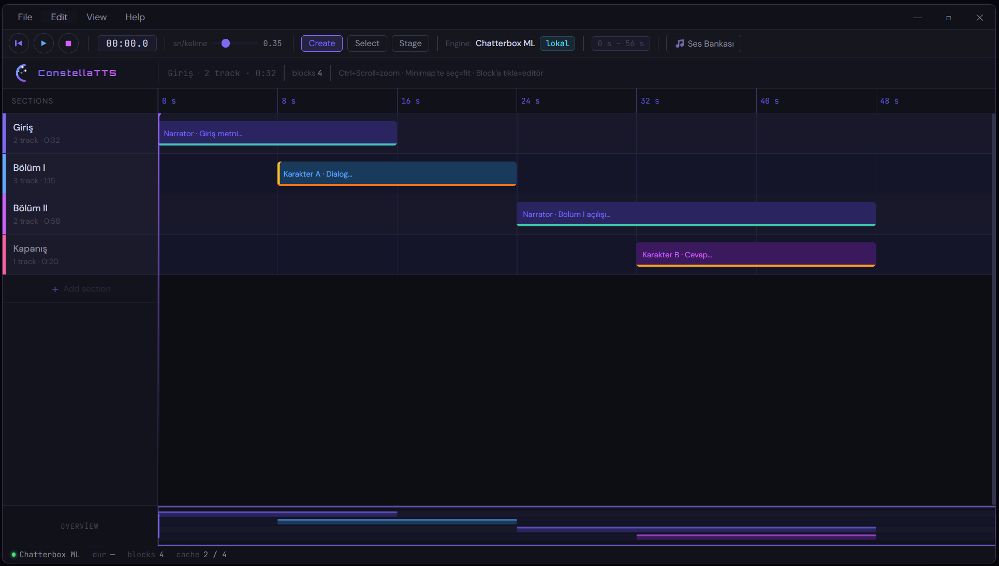
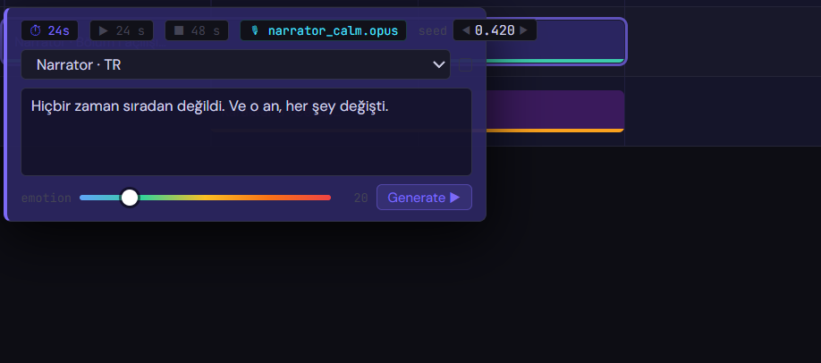
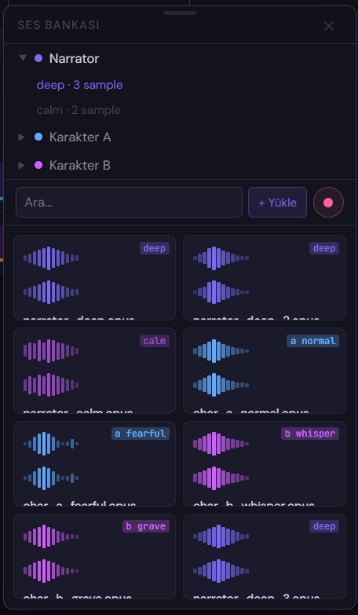

# ConstellaTTS Studio

> A DAW-based, plugin-driven TTS editor and audio production pipeline, built specifically for the Viteria universe.

ConstellaTTS Studio is a local-first desktop application for generating in-game dialogue, cutscene narration, and character voices. It works like a MIDI piano roll: each spoken sentence is a "section" positioned on a timeline, generated independently, and assembled into a final audio output.

**Stack:** Avalonia UI + C# · CommunityToolkit.Mvvm · Python IPC daemon (MessagePack) · OwnAudioSharp.Basic · Embedded Python 3.11

---

## Screenshots



<p align="center">
  
  &nbsp;
  
</p>

---

## Architecture

### Region System

Windows expose named regions via `RegionControl` in XAML. Each region has a
dot-path identifier (e.g. `MainWindow.Layout.Toolbar`) that views can be
mounted into and unmounted from at runtime. Regions are discovered by
scanning the open window's visual tree — no upfront declaration of a
slot tree, no separate window descriptor type.

```
MainWindow
  └── RegionControl  RegionId="MainWindow.Layout"
        └── MainLayout              ← mounted at startup
              ├── RegionControl  RegionId="MainWindow.Layout.Toolbar"
              ├── RegionControl  RegionId="MainWindow.Layout.ViewTools"
              └── RegionControl  RegionId="MainWindow.Layout.Content"
```

Region IDs are kept as string constants in `Regions` (SDK), so plugin
modules and core code share the same vocabulary without coupling
through generated types.

### Navigation

```csharp
nav.Navigate(new NavigationBuilder()
    .OpenWindow<MainWindow>()
    .Mount(Regions.Layout,    typeof(MainLayout))
    .Mount(Regions.Toolbar,   typeof(DawToolbarView))
    .Mount(Regions.ViewTools, typeof(ContextBarView))
    .Mount(Regions.Content,   typeof(TrackListView))
    .Build());
```

User-initiated navigation pushes to `IHistoryManager` so window opens,
mounts and flyout toggles are undoable with Ctrl+Z. Bootstrap navigation
bypasses history via `ApplyOnly` — otherwise Ctrl+Z immediately after
launch would close `MainWindow` and tear the app down.

### Plugin System

```csharp
public class MyPlugin : IConstellaModule
{
    public string Id   => "com.example.myplugin";
    public string Name => "My Plugin";

    public IReadOnlyList<Assembly> Dependencies =>
        [typeof(ConstellaTTSCoreModule).Assembly];

    public void Build(IServiceCollection services)
    {
        services.AddSingleton<MyView>();
    }
}
```

Plugins are discovered from `./plugins/` — DLLs scanned, `IConstellaModule`
implementations instantiated, sorted by dependency graph, then `Build()`
called in order. Plugins mount their UI by issuing navigation requests
against existing region IDs (or by exposing their own regions in plugin
windows).

### Timeline Editor

Blocks store time (`StartSec`, `DurationSec`); the viewport projects
to pixels at render time. Zoom and scroll change the projection without
ever touching stored coordinates — edits are zoom-independent and
serialisation is trivial.

```
ITimelineViewport (singleton)
    ↓  PxPerSec, ScrollOffsetSec
TrackListView            — canvas + rows + reorder drag
TimelineRulerControl     — tick ladder, wheel zoom
TimelineMinimapControl   — project overview, pan + fit-to-range

IToolModeService   — Select / Create, Section / Stage,
                     + PreviewTool / PreviewCreateType for Ctrl hover
ISelectionService  — SelectedBlock, SelectedTrack (drives editor overlay)
IHistoryManager    — CreateBlockAction / RemoveBlockAction (reversible)
```

Block-create collisions are resolved at commit time by
`BlockBumping.Compute`: right neighbours cascade further right, and
their original positions snapshot into the undo action so Ctrl+Z
restores the exact pre-create state. Ctrl-over-canvas transiently
overrides the tool to Create so any tool can draw without a mode
switch; the context bar highlights the override via the viewport's
`EffectiveTool` so the UI tracks the preview, not just the committed
state.

### IPC Daemon

Daemon is an embedded Python 3.11 subprocess the host launches on demand.
All traffic between C# and Python goes through Windows named pipes
(Unix domain sockets on Linux), framed as length-prefixed MessagePack:
`[4-byte LE uint32 length][payload]`.

```
Avalonia (C#)
    ↕  control pipe   — request/response, correlated by id
    ↕  job pipes       — one per streaming generation, unidirectional
Python daemon (single process, embedded Python 3.11)
    ↕
TTS models / route modules
```

**Routing.** Each module under `daemon/modules/` exports a module-level
`Route` object. Registry auto-discovers them — single-file routes like
`modules/echo.route.py` and folder-based models like
`modules/models/chatterbox_ml/router.py` share the same convention.
Action names map directly to wire strings: `fake.generate`, `health.check`.

**Streaming.** `generate` returns `{"job_id", "stream_pipe"}`; the C# side
opens the `stream_pipe` and receives `{"type": "chunk", "data": ...}`
frames until a terminal `done` / `error` / `cancelled` event. A
bounded-capacity queue on the daemon side provides backpressure: slow
consumers push back on the producer, avoiding unbounded memory use
(and incidentally keeping VRAM pressure in check under slow clients).

**Job admin.** Each `BaseTTSModel` subclass gets `cancel(job_id)` and
`list_jobs()` actions for free — no extra plumbing in the router.

**Transport.** Windows uses `ProactorEventLoop.start_serving_pipe`
(IOCP-backed, true overlapped I/O) so concurrent reads and writes on
the same pipe handle don't deadlock the way a thread-bridged sync-mode
pipe would. The control pipe path is deterministic —
`\\.\pipe\constella_<pid>_control` — so the host finds the daemon
simply by deriving the path from the spawned process's PID. No stdout
or stderr sideband is required for discovery; the named pipe namespace
itself is the rendezvous.

### Audio I/O

> The runtime audio layer is being rewritten on top of OwnAudioSharp.Basic
> (cross-platform, MIT). The previous NAudio-based prototype and the
> stand-in `BufferStreamer` ring-buffer were removed during the namespace
> refactor and will be replaced by codec-capability interfaces
> (`IFlacWriter`, `IFlacReader`, `IPcmEncoder`, `IPcmDecoder`) plus a
> `SampleLibService` that owns sample import, storage and playback.
> See `notes/constellatts-audio-layer-decision.md` for the design notes.

---

## TTS Engine Matrix

| Engine | Turkish | VRAM | Duration Strategy | License |
|--------|---------|------|-------------------|---------|
| Chatterbox ML | ✅ | ~4–6 GB | Auto, Rubberband | MIT |
| F5-TTS | ✅ community | ~6 GB | Auto, Rubberband, Interpolate | MIT |
| Fish S2 local | ✅ 83 langs | ~12 GB (NF4) | Auto, Rubberband | Source-available* |
| XTTS-v2 | ✅ native | ~6–8 GB | Auto, Rubberband, Interpolate | CPML* |
| IndexTTS-2 | ❌ | ~8 GB | All | Research |
| Whisper large-v3-turbo | — | ~6 GB | — (QC only) | MIT |

*Fish S2 and XTTS-v2 have commercial restrictions — Chatterbox and F5-TTS are clear for commercial use.

---

## Getting Started

```bash
git clone https://github.com/stellayazilim/ConstellaTTS.git
cd ConstellaTTS

# Dev setup — downloads embedded Python 3.11, installs pip + daemon deps
dotnet script infra/setup.csx

dotnet restore
dotnet run --project src/ConstellaTTS.Avalonia
```

Place plugin DLLs in `./plugins/` next to the executable.

### Verifying the IPC layer

A Python-only smoke test exercises the daemon's request/response,
streaming, cancel, and `list_jobs` paths without any C# involvement:

```bash
cd src/ConstellaTTS.Daemon
..\..\infra\python\python.exe test_client.py
```

The C#-side equivalent drives the daemon through the SDK client
(`IPCClient`) and also covers concurrent correlation and the
`IPCStream` streaming API. Build the SDK first, then run the script:

```bash
dotnet build src/ConstellaTTS.SDK.IPC/ConstellaTTS.SDK.IPC.csproj
dotnet script infra/test_ipc.csx
```

Both scripts spawn their own daemon, run the assertions, and shut it
down. Daemon logs land in `src/ConstellaTTS.Daemon/logs/` (gitignored).

> **If the C# script hangs or reports stale errors after a rebuild**,
> `dotnet-script` is serving a cached copy of the SDK DLL. Clear it:
>
> ```powershell
> Remove-Item -Recurse -Force $env:LOCALAPPDATA\dotnet-script -ErrorAction SilentlyContinue
> Remove-Item -Recurse -Force $env:TEMP\dotnet-script -ErrorAction SilentlyContinue
> ```

---

## Writing a Plugin

1. Create a class library targeting `net10.0`
2. Reference `ConstellaTTS.SDK` and optionally `ConstellaTTS.SDK.IPC`
3. Implement `IConstellaModule`
4. Register services in `Build()`
5. Mount UI by issuing navigation requests against `Regions.*` IDs
6. Drop compiled DLL into `./plugins/`

---

## Roadmap

| Phase | Focus |
|-------|-------|
| **Done** | IPC daemon — named-pipe transport, routing, streaming, backpressure, cancel |
| **Done** | Timeline editor — track list, ruler, minimap, block create/select/delete, undoable history |
| **Done** | Core namespace refactor — type-based folders, dead-code purge |
| **Now** | Audio runtime layer — `IFlacWriter`/`IFlacReader` + `IAudioPlayer` on OwnAudioSharp.Basic |
| **Now** | Sample library v2 — `ISampleLibService`, file dialog + drag-drop import, playback wiring |
| **Next** | Domain persistence — `.wwv` project format, save/load, dirty tracking |
| **Next** | First real TTS adapter (Chatterbox), waveform extraction |
| **Soon** | Section editor v2 — sample picker modal, generation cache, listen-while-generating |
| **Soon** | Plugin manifest system, adapter generator, drag & drop model install |
| **Later** | Duration control (Rubberband, ScalerGAN, IndexTTS-2), export pipeline |

---

## Progress Checklist

### ✅ Platform & Architecture
- [x] Avalonia UI selected (Skia-based, cross-platform, WPF heritage)
- [x] Solution structure — SDK / SDK.IPC / Core / Avalonia / Domain separation
- [x] Plugin module system — `IConstellaModule`, `ConstellaModuleRegistry`, topological sort
- [x] `ConstellaApp` singleton — central application context
- [x] DI via `Microsoft.Extensions.DependencyInjection`
- [x] Type-based folder layout in Core (`Managers/`, `Services/`, `Controls/`, `Behaviors/`, `Converters/`, `Layouts/`, `Recorders/`, `Misc/`, `ViewModels/`, `Views/`, `Windows/`, `Actions/`)

### ✅ Window & Region System
- [x] Custom title bar — ribbon menu integrated, native chrome removed
- [x] `MainWindow` — shell with named regions
- [x] `MainLayout` — DAW chrome (toolbar, logo row, content, status bar) declared via `RegionControl`
- [x] `IRegionManager` + `RegionManager` — visual-tree scan, mount/unmount by region ID
- [x] Window lifecycle — `NavigationManager` resolves windows from DI, no separate factory layer

### ✅ Navigation
- [x] `NavigationRequest` hierarchy — Open/Close window, Show/Hide flyout, Mount/Unmount region, Queue
- [x] `NavigationBuilder` — fluent API
- [x] `INavigationManager` — orchestrates window + region operations
- [x] `Navigate(...)` pushes to `IHistoryManager` — fully undoable
- [x] `ApplyOnly(...)` for bootstrap — initial window+mounts excluded from history (so Ctrl+Z can't kill the app)

### ✅ History
- [x] `IHistoryManager` + `HistoryManager` — stack-based undo/redo; merge logic stays out, history layer is dumb on purpose
- [x] `IReversible` — actions produce their inverse on `Reverse()`
- [x] `IEffect` — action dispatches side-effect actions; carrier is the single history entry, Ctrl+Z reverses all
- [x] `SelectAction : IReversible` — each click its own history entry (Vim/Spine2D jumplist semantics)
- [x] `ViewportChangeAction : IReversible, IEffect` — snapshots zoom + scroll together; Ctrl+Z restores viewport
- [x] `IViewportHistoryRecorder` — Touch/Flush debounce; input-agnostic (wheel, minimap, keyboard all coalesce into one entry)
- [x] `ViewportHistoryRecorder` — 250 ms DispatcherTimer debounce, no-op filter (FROM == TO skipped)
- [x] Block create, delete, bump, select, viewport scroll/zoom — every edit undoable

### ✅ Theme System
- [x] `IThemeProvider` — global/per-theme style registration, JSON color theme loading
- [x] `ThemeProvider` — `RegisterGlobal`, `RegisterForTheme`, `LoadColorTheme`, `ApplyTheme`
- [x] Module self-registers its own styles — no hardcoded `App.axaml` imports

### ✅ UI & Controls
- [x] Füme + neon purple color scheme (`#0D0D14` base, `#7c6af7 → #d060ff` gradient)
- [x] `MainTheme.axaml` — all colors in one resource dictionary
- [x] `PlayerButton` + `PlayerIcon` — vector icon controls, path-based, color via `Foreground`
- [x] Transport controls — GoToStart / Play / Stop with hover + press states
- [x] ConstellaTTS logo — SVG with crescent, constellation, waveform
- [x] `ConstellaSlider` — custom `RangeBase`; Solid / Gradient / Emotion modes; Emotion mode samples `EmotionColors` for dynamic thumb color
- [x] `EmotionColors` — 5-stop sRGB interpolation: blue → green → amber → orange → red
- [x] Sample Library toggle flicker fix — outside-click detection via named `SampleLibraryButton` ancestor lookup

### ✅ Exception Handling
- [x] `ConstellaException` base class — normalized exception hierarchy (SDK)
- [x] `IExceptionHandler` — `Handle(ConstellaException)` interface (SDK)
- [x] `ExceptionHandler` — logs + raises `ExceptionHandled` event for UI layer (Core)
- [x] `IPCException` hierarchy — `DaemonNotRespondingException`, `DaemonStartFailedException`, `IPCTimeoutException`

### ✅ IPC Daemon
- [x] `IIPCService` + MessagePack message records (`SDK.IPC`)
- [x] `IPCClient` — request/response correlation, background read loop
- [x] Length-prefixed MessagePack framing, 16 MiB frame cap
- [x] Windows named pipes via `ProactorEventLoop.start_serving_pipe` (IOCP)
- [x] Unix domain socket transport (`_unix_socket.py`) scaffolded for Linux
- [x] Convention-based route discovery — `*.route.py` + `models/*/router.py`
- [x] `BaseTTSModel` — lazy load, VRAM semaphore, `inspect`/`load`/`unload` actions
- [x] `StreamChannel` — per-job pipe, bounded-capacity backpressure
- [x] Job admin actions — `cancel(job_id)`, `list_jobs()`
- [x] `IPCStream` C# API — `StartStreamAsync` + `ReadEventsAsync` + `CancelAsync`
- [x] `model.json` metadata auto-loaded, exposed via `inspect`
- [x] Daemon logging to rotating files (`logs/daemon_<pid>_<ts>.log`)
- [x] Single-instance lock, graceful shutdown on stdin EOF + SIGINT/SIGTERM
- [x] Embedded Python 3.11 — `infra/setup.csx` / `infra/teardown.csx`
- [x] End-to-end smoke tests — `test_client.py` (Python) + `infra/test_ipc.csx` (C#)

### 🔲 IPC Daemon — later
- [ ] Watchdog on streaming jobs (fire `DaemonNotRespondingException` on stalled chunk)
- [ ] VRAM-aware LRU eviction across registered models
- [ ] Dynamic backpressure tuning (`set_capacity` admin action)
- [ ] Source-generated typed client — `await client.Fake.GenerateAsync(...)`
- [ ] `ILogger<IPCClient>` integration — promote ad-hoc `[ipc]` lines to proper `LogLevel.Debug`, let hosts filter via the usual logging config

### ✅ Timeline Editor

**Viewport & geometry**
- [x] `ITimelineViewport` — single source of truth for `PxPerSec` / `ScrollOffsetSec`
- [x] `TimelineViewport.Current` singleton with `INotifyPropertyChanged`
- [x] Time-domain storage — `StartSec` / `DurationSec` on VM; pixels computed at render boundary
- [x] `TimelineConverters.TimeToPx` / `DurationToPx` — `IMultiValueConverter`s for viewport-aware binding

**Track list**
- [x] `TrackListView` — 200 px header + canvas layout, per-row drop indicator
- [x] `TrackListViewModel.Tracks` — observable collection with `Reorder` / `AddTrack` / `RemoveTrack`
- [x] `TrackViewModel` — `Track` primitive binding + drag-ghost state
- [x] Drag-to-reorder — header press, floating preview, 3-stage release animation (close source → open target → commit)
- [x] Track rename — double-click or right-click header → inline `TextBox`; Enter/LostFocus commit, Escape reverts to snapshot
- [x] Track add — context bar + Track button, palette-cycled accent
- [x] `RemoveTrackAction` — history-tracked track delete (Ctrl+Z restores)

**Blocks (Sections + Stages)**
- [x] `IStageViewModel` — shared geometry (StartSec/DurationSec/EndSec/Label/Bg/AccentColor)
- [x] `ISectionViewModel : IStageViewModel` — adds Emotion, Dirty, Model
- [x] `StageViewModel` — dashed-outline visual annotation, no TTS pipeline
- [x] `SectionViewModel` — full TTS block with emotion gradient strip + dirty indicator
- [x] Polymorphic `Sections` collection — `ObservableCollection<IStageViewModel>`
- [x] `TimelineItemsPanel` — custom `Panel` replacing `Canvas`; arranges children directly via `IStageViewModel` time coords; hit-test bounds = visual bounds

**Ruler**
- [x] `TimelineRulerControl` — self-drawing with nice-number tick ladder (0.05s → 3600s)
- [x] 60 px min tick spacing — labels rescale automatically across zoom levels
- [x] Plain wheel = horizontal pan, Ctrl+wheel = cursor-anchored zoom

**Minimap**
- [x] `TimelineMinimapControl` — self-drawing project overview with per-track bands
- [x] Fixed project-end scale — `max(lastBlock.EndSec, 30s)`, viewport-independent
- [x] Viewport indicator — dim overlay outside + violet frame inside, clamped to minimap bounds
- [x] Plain drag → delta-based viewport pan (no click-jump)
- [x] Ctrl+drag → select-range preview → fit canvas to selection on release

**Create gesture**
- [x] Drag on canvas → preview rectangle with live duration label inside
- [x] Press inside existing block → anchor snaps to block's `EndSec` (grows rightward)
- [x] Left-clamp to previous neighbour's end (zoom-independent, time domain)
- [x] Commit-time cascading right-push — `BlockBumping.Compute` records original positions
- [x] `CreateBlockAction` / `RemoveBlockAction` — symmetric reversible actions with bump snapshot
- [x] Ctrl override = Section, Ctrl+Shift override = Stage (regardless of committed tool)
- [x] Auto-switch to Select + focus new block on release

**Select & edit**
- [x] `IToolModeService` — Select / Create toggle + Section / Stage sub-type
- [x] Preview layer (`PreviewTool` / `PreviewCreateType`) — hover-driven transient override
- [x] `ISelectionService` — `SelectedBlock` + `SelectedTrack`
- [x] Click block in Select mode → selection + open editor overlay
- [x] Click empty canvas → clear selection + close editor
- [x] Block editor v2 — seed row (`◀ value ▶ | 🎲` + advance mode), engine ComboBox, multiline TextBox, emotion + temperature `ConstellaSlider`s, sample chip, Generate button
- [x] `SeedAdvanceMode` — Fixed / Increment / Decrement / Random; `AdvanceSeed()` after each successful generation
- [x] Echo control — `_suppressLabelEcho` + `_suppressSectionEcho` flags prevent VM↔UI oscillation
- [x] Editor auto-positions below selected block, viewport-aware
- [x] Editor auto-collapses when block scrolls fully off-screen
- [x] Left/right clamp — editor never overlaps track-header column or spills offscreen
- [x] Ctrl hover preview — context bar highlights Create/Section without committing
- [x] `TopLevel` key listener — Ctrl state transitions apply instantly without mouse movement
- [x] Context bar Section/Stage buttons hidden outside Create mode (no misleading affordances)
- [x] Context bar Delete button — history-tracked `RemoveBlockAction` (Ctrl+Z restores)
- [x] Context bar + Track button — appends new track with palette-cycled accent

**Input routing**
- [x] Wheel: plain = horizontal scroll, Shift = vertical (ScrollViewer), Ctrl = zoom
- [x] Ruler wheel inherits canvas semantics (same modifiers, same feel)
- [x] `PointerCaptureLost` + `_inReleaseHandler` re-entry guard — synchronous `Capture(null)` during release doesn't wipe drag state
- [x] Block editor pointer isolation — presses inside don't leak into canvas gestures

### 🔲 Audio Runtime (in design)
- [x] OwnAudioSharp.Basic chosen as cross-platform audio backend (Win/Linux/macOS, MIT, miniaudio/PortAudio core)
- [x] NAudio-based prototype removed — Windows-only constraint incompatible with cross-platform target
- [x] `IFileWriter` / `IFileReader` / `IPcmEncoder` / `IPcmDecoder` capability interfaces
- [x] `IFlacWriter : IFileWriter, IPcmEncoder` / `IFlacReader : IFileReader, IPcmDecoder`
- [ ] `IAudioPlayer` interface — PCM stream + `AudioFormat`, Play/Stop
- [ ] `FlacWriter` / `FlacReader` concrete drivers on OwnAudioSharp.Basic
- [ ] FLAC encode capability spike — confirm OwnAudioSharp.Basic supports it (decode is documented; encode flagged as "to verify")
- [ ] `OwnAudioSharpAudioPlayer` — concrete player wired to the mixer

### 🔲 Sample Library (in design)
- [x] `ISampleProvider` / `ISampleImporter` legacy interfaces removed — clean slate for v2
- [x] `FlacSampleImporter` (NAudio-based) removed
- [ ] `ISampleLibService` — filesystem-as-db: `List`, `AddAsync`, `Remove`, `Play`
- [ ] `ISampleLibraryViewModel` — owns the observable collection bound by the picker
- [ ] `SampleLibService` concrete — uses `IFlacWriter` / `IFlacReader` / `IAudioPlayer`
- [ ] `UploadButton.Click` → `IStorageProvider.OpenFilePickerAsync` (filter: mp3, wav, flac, ogg, m4a)
- [ ] `DragDrop.AllowDrop` + `Drop` on `SampleLibraryWindow` — path extract → `AddAsync`
- [ ] DI registration in `ConstellaTTSCoreModule`
- [ ] Sample picker modal in block editor — replaces cycling chip with browseable list + audio scrub
- [ ] Section ↔ VM persistence: `VoiceSample.Id`, `EngineId`, `Temperature`, `SeedMode`
- [ ] `EngineDescriptor.SupportsEmotion=false` → hide emotion slider per-engine

### 🔲 Project & Persistence
- [ ] `Section` domain model — text, seed, voice_ref, WER, QC metadata
- [ ] `Project` root — tracks, sections, global refs, metadata
- [ ] `.wwv` file format (ZIP: `project.json` + `refs/` + `generated/` + `meta.json`)
- [ ] Save/load round-trip, dirty tracking at project level
- [ ] WER warning icon on sections (Whisper transcript deviation threshold)
- [ ] Recent projects menu, autosave timer

### 🔲 Python TTS Daemon
- [ ] First real adapter: Chatterbox Multilingual
- [ ] Waveform extraction — peak sampling, float array, returned alongside wav path
- [ ] Real-time PCM chunk emission (vs. the current char-per-chunk fake)

### 🔲 Plugin System
- [ ] `plugin.json` manifest schema
- [ ] `PluginManifest.Compute()` → `ExtraParamsBefore / ExtraParamsAfter`
- [ ] `AdapterGenerator` — generates `adapter.py` from manifest
- [ ] `inspector.py` — AST analysis for drag & drop model auto-detection
- [ ] Manifest Edit screen — ✓ green / ? yellow / ✗ red wizard UI
- [ ] Model drag & drop → auto manifest → adapter generate flow
- [ ] Extension plugin type (`IExtensionPlugin` — C# assembly, new UI panels)

### 🔲 Audio Generation
- [ ] Space → generate + play selected section
- [ ] Shift+Space → queue from selected section
- [ ] Whisper large-v3-turbo integration — transcript, WER quality control
- [ ] Generation cache — SHA256 hash (text + voice_ref + emotion + seed + engine + extras)
- [ ] Global cache (`AppData`) + project-local cache (`.wwv/generated/`)
- [ ] Listen-while-generating toggle (▶G) — dirty section enter triggers generation

### 🔲 Duration Control
- [ ] `DurationStrategy` — Auto / Rubberband / Interpolate / Generate
- [ ] Rubberband post-processing with stretch ratio warnings
- [ ] ScalerGAN integration for extreme stretch
- [ ] IndexTTS-2 token control (`target_tokens = target_sec * 21`)

### 🔲 Visual Enhancements
- [ ] Emotion graph — `Polyline` per track, emotion over time axis
- [ ] Waveform overlay — peak-sampled float array rendered on sections
- [x] Stage direction sections — dashed style, no waveform, excluded from emotion graph
- [x] Ctrl+Scroll zoom on timeline — cursor-anchored, clamped at [4, 400] px/sec
- [x] Emotion spring color scale (blue → green → yellow → orange → red) — `Gradient-Emotion` bottom strip on sections
- [x] Dirty indicator (yellow left border) on sections
- [ ] WER warning icon on sections
- [ ] Track expand/collapse animation
- [ ] `ItemsRepeater` virtualization for long timelines

### 🔲 Export
- [ ] All tracks → single mixed WAV
- [ ] Per-track WAV export
- [ ] Per-section WAV export (game asset pipeline)
- [ ] Mix + stems
- [ ] SRT / VTT subtitle export
- [ ] WAV → Opus compression (~93% size reduction)

### 🔲 Import
- [ ] SRT / VTT import → auto section generation
- [ ] Reference audio drag & drop → Whisper auto-transcript

---

## License

[MIT](./LICENSE) — fork freely, keep the copyright notice.

---

## References

- [Avalonia UI](https://avaloniaui.net)
- [CommunityToolkit.Mvvm](https://learn.microsoft.com/en-us/dotnet/communitytoolkit/mvvm/)
- [MessagePack for C#](https://github.com/MessagePack-CSharp/MessagePack-CSharp)
- [OwnAudioSharp](https://github.com/ModernMube/OwnAudioSharp)
- [ScalerGAN](https://github.com/MLSpeech/scaler_gan)
- [IndexTTS-2](https://github.com/index-tts/index-tts)
- [Chatterbox TTS Server](https://github.com/devnen/Chatterbox-TTS-Server)
- [ComfyUI-FishAudioS2](https://github.com/Saganaki22/ComfyUI-FishAudioS2)
